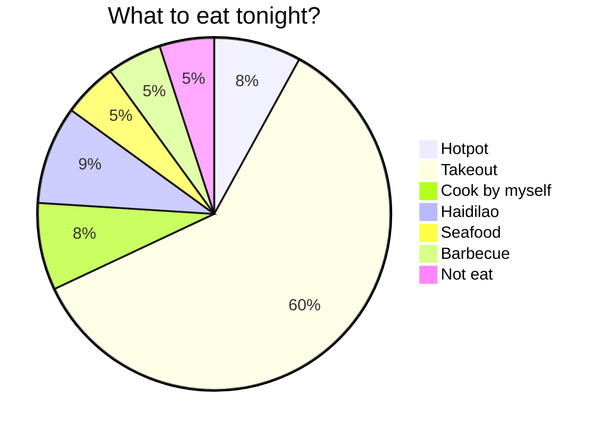
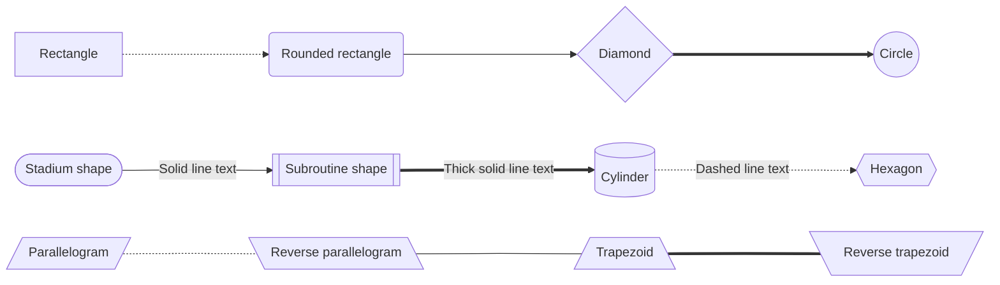
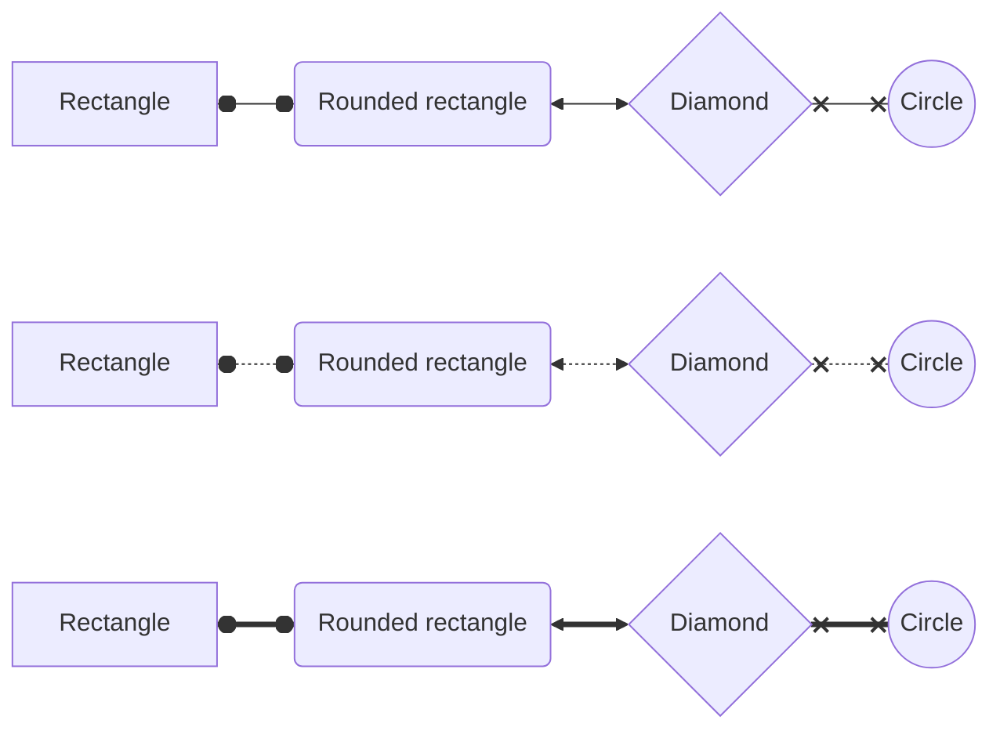
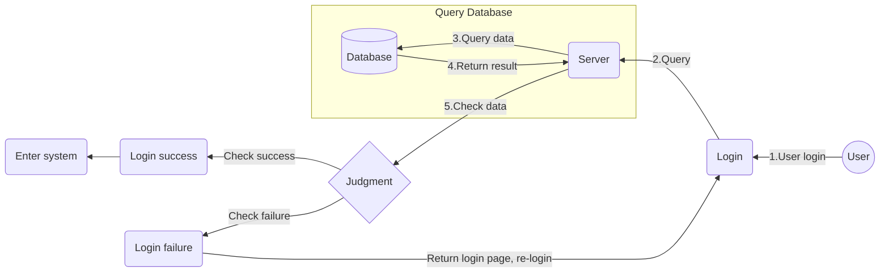
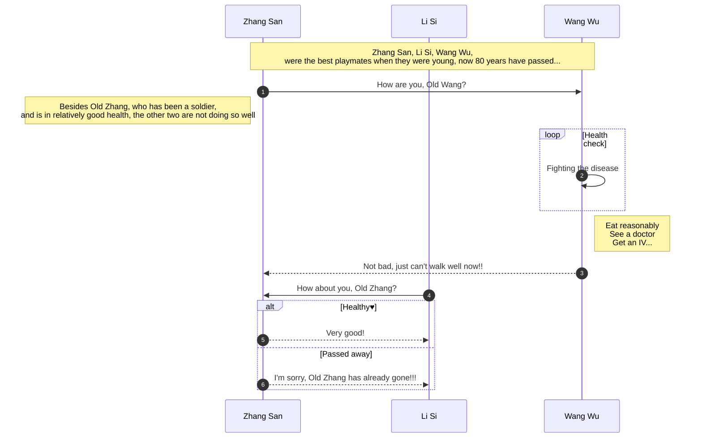
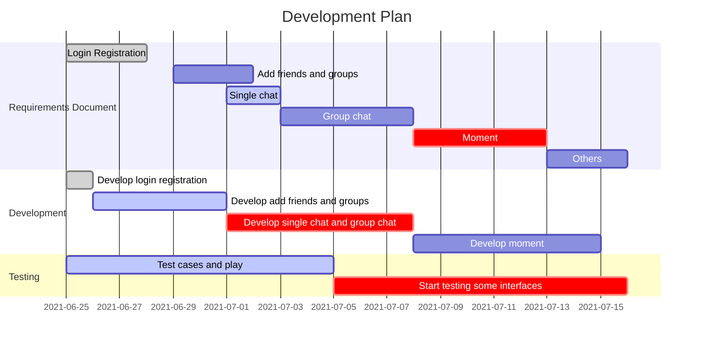
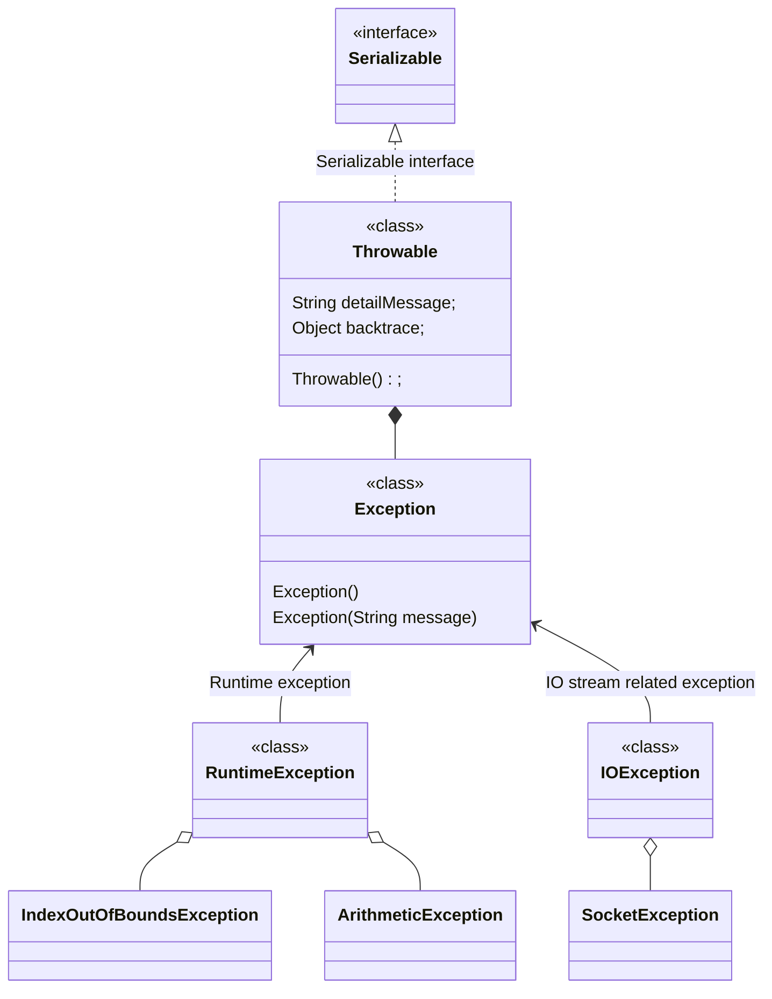
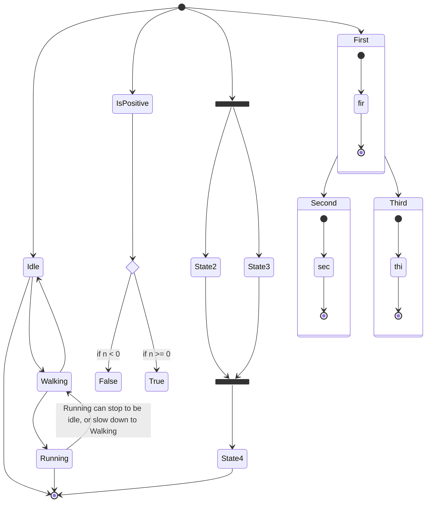
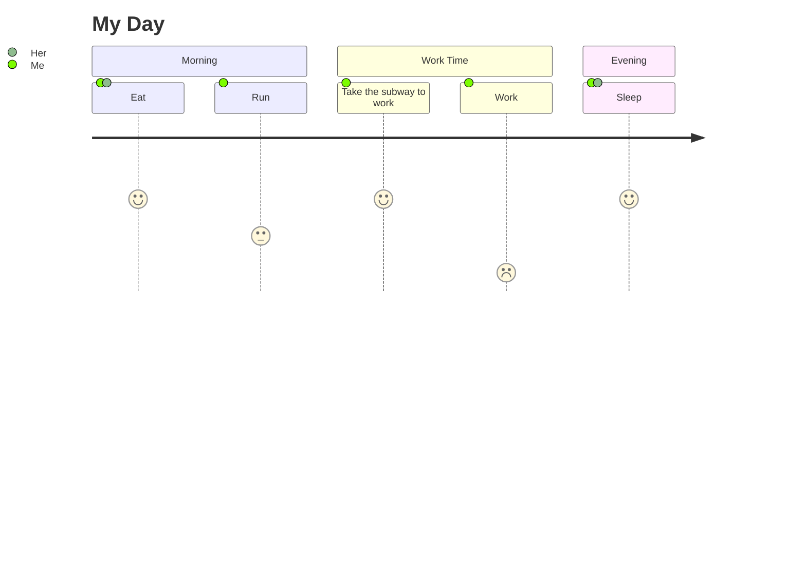

# Markdown Flowchart

## Types of Flowcharts

- `mermaid` chart
- `flow` chart
- `sequence` chart

## Mermaid

- [Mermaid](https://github.com/mermaid-js/mermaid) is a JavaScript-based drawing tool that uses a syntax similar to Markdown, allowing users to easily create charts through code.

### What types of charts can Mermaid draw?

- **Pie chart**: Use the `pie` keyword
- **Flowchart**: Use the `graph` or `flowchart` keyword
- **Sequence diagram**: Use the `sequenceDiagram` keyword
- **Gantt chart**: Use the `gantt` keyword
- **Class diagram**: Use the `classDiagram` keyword
- **State diagram**: Use the `stateDiagram` keyword
- **User journey diagram**: Use the `journey` keyword

#### Pie Chart

- The first line specifies the keyword `pie`
- The title keyword is `title`, which is optional
- Comments: `%%` + `comment text` at the beginning of the line



#### Flowchart

- The first line: `graph` + `direction`
- Direction options:
  - From top to bottom `TD` or `TB`
  - From bottom to top `BT` or `DT`
  - From left to right `LR`
  - From right to left `RL`
- Shapes
  - `[Rectangle]` `(Rounded rectangle)` `{Diamond}` `((Circle))`
  - `([Stadium shape])` `[[Subroutine shape]]` `[(Cylinder)]` `{{Hexagon}}`
  - `[/Parallelogram/]` `[\Reverse parallelogram\]` `[/Trapezoid\]` `[\Reverse trapezoid/]`
- Lines
  - Dashed arrow: `-.->`
  - Solid arrow: `-->`
  - Thick solid arrow: `==>`
  - Text arrow:
    - `-.text.->`
    - `--text-->`
    - `==text==>`
  - Arrowless: remove `>`
  - Connection symbols: `o` `x` `<` `>`
- `graph` flowchart



- `flowchart` flowchart



- `subgraph` sub-process `end`



#### Sequence Diagram

- Use `sequenceDiagram`
- `autonumber` can automatically label the sequence
- Use aliases: `participant alias as display name`
- Comment annotations:
  - Format: `Note over participant1,participant2: comment content` displayed between two participants
  - Format: `Note left of participant1: comment content` displayed on the left of participant1
  - Format: `Note right of participant1: comment content` displayed on the right of participant1
- Lines: `-> solid line`, `->> solid line arrow`, `--> dashed line`, `-->> dashed line + arrow`, `-x line with a cross`
- Background highlighting can use: `rect rgb(0, 255, 0) ... end`
- Self-loop use `loop ... end`
- Judgment use `alt ... else ...else ... end`, if there is no else, you can use: `opt .... end`



#### Gantt Chart

- Gantt charts are a type of bar chart, proposed by Karol Adamiechi in 1896, and independently proposed by Henry Gantt in 1910.
- They are usually used to describe the start and completion times of project terminal elements and summary elements.

| Mark       | Introduction                                          |
| ---------- | ----------------------------------------------------- |
| title      | Title                                                 |
| dateFormat | Date format                                           |
| section    | Module, defines the vertical direction                |
| done       | Already completed                                     |
| active     | Currently ongoing                                     |
| crit       | Critical phase, urgent, will be highlighted           |
| after      | Default starts from the end time of the previous item |



#### Class Diagram

- Use the `classDiagram` keyword
- Then define the class, its properties, and methods like writing Java code
- Then connect the relationships between them with lines
- Format: `Class1 line Class2: note`
- Lines: `<|--`、`*--`、`o--`、`..`、`<-->`、`--|>`
- Types:
  - `<<Interface>>` represents an interface class
  - `<<abstract>>` represents an abstract class
  - `<<Service>>` represents a service class
  - `<<enumeration>>` represents an enumeration



#### State Diagram

- Use the `stateDiagram` keyword
- There are two special state indicators for the start and stop of the chart.
- These are written with the `[*]` syntax, and the direction of the transition defines them as start or stop states.
- A transition is the path from one state to another, represented by the arrow "–>".
- In practical use of state diagrams, you often get multi-dimensional diagrams because a state can have multiple internal states. These are called composite states in this terminology.
- To define a composite state, you need to use the `state` keyword, followed by an `id` and `{}` containing the body of the composite state.



#### User Journey Diagram

- Use the `journey` keyword
- Format: `Task:Score:Role list (multiple separated by commas)`



## Flow

- Standard flowchart
- The code mainly consists of two parts:
  - The first part: Define elements
    - **start** # Start
    - **end** # End
    - **operation** # Operation
    - **subroutine** # Subroutine
    - **condition** # Condition
    - **inputoutput** # Input or output
  - The second part: Define the direction of elements
    - Format: `Element name=>Element type: Display node content` (There must be a space after the colon)
    - Define element type use `=>`
    - Connect two elements use `->`
    - The direction of elements can use: `left`、`right`、`top`、 `bottom`

```flow
st=>start: Start box
op=>operation: Process box
cond=>condition: Decision box (Yes or no?)
sub1=>subroutine: Subroutine
io=>inputoutput: Input/output box
e=>end: End box
st->op->cond
cond(yes)->io->e
cond(no)->sub1(right)->op
```

## Sequence

- Sequence diagram
- The syntax is the same as Mermaid's sequence diagram, but the generated diagram is more concise.

### Simple Example

```sequence
Object A->Object B: Are you okay, Object B? (Request)
Note right of Object B: Description of Object B
Note left of Object A: Description of Object A (Hint)
Object B-->Object A: I'm fine (Response)
Object A->Object B: Are you really okay?
```

### Complex Example

```sequence
Object A->Object B: Are you okay, Object B? (Request)
Note right of Object B: Description of Object B
Note left of Object A: Description of Object A (Hint)
Object B-->Object A: I'm fine (Response)
Object B->Object C: Are you okay
Object C-->>Object A: Object B is looking for me
Object A->Object B: Are you really okay?
Note over Object C,Object B: We are friends
participant D
Note right of D: No one plays with me
```

